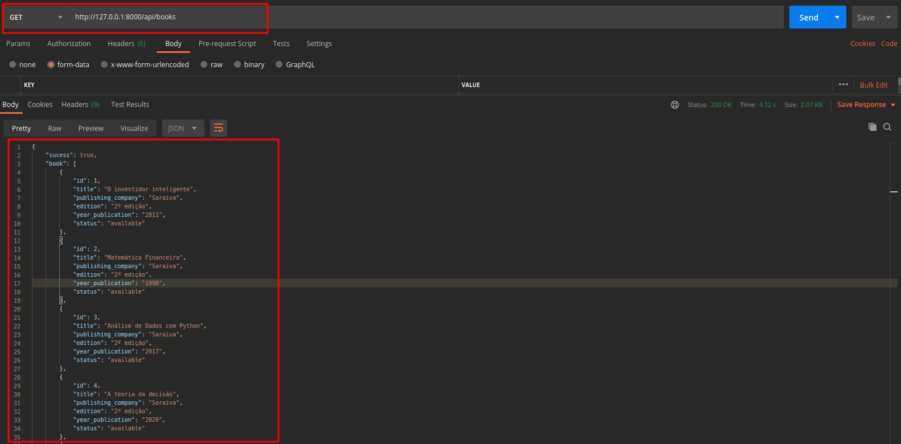

<h1>INTRODUÇÃO</h1>

<body>Projeto teste criado para simular uma livraria online. O projeto possui uma listagem de livros emprestados e caso exista multa a sua vizualização.
Possui uma listagem de livros reservados de acordo com o livro e uma listagem de todos os livros cadastrados e seus staus seja disponível ou emprestado. 

<body>
<h2>Índice</h2>
<ul>
    <li><a href="#estruturaprojeto">Estrutura Projeto</a>
        <ul>
            <li><a href="#appbook">App Book</a></li>
            <li><a href="#apploan">App Loan</a></li>
            <li><a href="#apppenalty">App Penalty</a></li>
            <li><a href="#apppricing">App Pricing</a></li>
            <li><a href="#appreservation">App Reservation</a></li>
            <li><a href="#projetocore">Projeto Core</a></li>
        </ul>
    </li>
    <li><a href="#regras">Regras</a></li>
    <li><a href="#instrucoesapi">API</a>
    <li><a href="#instrucoesexecucao">Instruções de execução</a></li>
    <li><a href="#tecnologiasusadas">Tecnologias Usadas para Desenvolvimento</a>
        <ul>
            <li><a href="#sistemaoperacional">Sistema Operacional</a></li>
            <li><a href="#ide">IDE</a></li>
            <li><a href="#frameworks">Frameworks</a></li>
            <li><a href="#testeapi">Teste API</a></li>
        </ul>
    </li>
</ul>
<h2 id="estruturaprojeto">Estrutura do Projeto</h2>
        A estrutura do projeto está organizado em 5 apps, sendo elas book, loan, penalty, pricing, reservation e o projeto core.
        A organização do banco de dados obedece o diagrama abaixo:
        
        <h4 id="appbook">App Book</h4>
            <ol>
                <li>App responsável pelos dados do book, sendo o title, publising_company, edition, year_publication e create_at.</li>
                <li>Possui uma url e uma view.</li>       
                <li>Sua view retorna todos os livros e seu status se está disponível ou emprestado.</li>    
                <li>Possui uma requisição GET.</li>   
            </ol>         
        <h4 id="apploan">App Loan</h4>
            <ol>
                <li>App responsável pelos empréstimo realizados, sendo book, user, loan_date, delivery_date, date_returned.</li>
                <li>Possui uma url e uma view.</li>
                <li>Sua view retorna  todos os livros emprestados e caso possua multas, sua visualização.</li>
                <li>Possui uma requisição GET.</li>
            </ol>  
        <h4 id="apppenalty">App Penalty</h4>
             <ol>
                <li>App responsável pelos dados de multa relacionados a um empréstimo, sendo loan, delayed_days, fine_amount, penalty_fee, interest_per_day, total_paid.</li>  
                <li>Não possui nem urls e views</li>
                <li>Não possui requisições.</li>
            </ol>  
        <h4 id="apppricing">App Pricing</h4>
             <ol>
                <li>App responsável pelos dados de precificação da multa, sendo penalty, interest_per_day e delayed_days.</li>
                <li>Não possui VIEW ou URLS.</li>    
                <li>Possui uma pasta fixtures com um arquivo pricing.json com dados de precificação para o cálculo de multa.</li>
                <li>Não possui requisições.</li>
            </ol>
       <h4 id="appreservation">App Reservation</h4>
             <ol>
                <li>App responsável pelos dados de reserva de um livro sendo user, book, active, date_reservation, date_reservation_final</li>
                <li>Possui uma URL principal.</li>    
                <li>Possui uma VIEW principal, responsável pelo retorno dos livros reservados de acordo com o usuário.</li>
                <li>Possui uma pasta fixtures com um arquivo reservation.json com dados fictíceos de reserva.</li>
                <li>Possui uma requisição POST.</li>
            </ol>   
        <h4 id="projetocore">Projeto Core</h4>
            <ol>
                <li>Projeto principal do django.</li>
                <li>Adicionado ao arquivo settings.py todas as variáveis usadas como constantes no projeto. </li>
            </ol>  
<h2 id="regras">Regras Implementadas</h2>
    <ul>
        <li>Empréstimos com atraso de até 3 dias, possui 3% sobre o valor da multa mais 0,2% de juros por dia.</li>
        <li>Empréstimos com atraso acima de até 4 dias, possui 5% sobre o valor da multa mais 0,4% de juros por dia.</li>
        <li>Empréstimos com atraso acima de 5 dias, possui 7% sobre o valor da multa mais 0,6% de juros por dia.</li>
        <li>Não é possível reservar um livro que já esteja reservado.</li>
    </ul>
<h2 id="instrucoesapi">API</h2>
    <h3 id="instrucoesexecucao">Instruções de execucão</h3>
        Ao abrir o projeto pela IDE Pycharm, realizar a instalação do ambiente virtualenv, atráves do seguindo comando:
        <ul>
            <li>python3 -m virtualenv venv</li>
        </ul>
        Após instalação, realizar a ativação do ambiente virtual, através do comando:
         
        <ul>
            <li>. venv/bin/activate</li> 
        </ul>
        Após ativação do ambiente virtual é possível realizar a instalação dos pacotes necessários para a execução da aplicação abrindo o arquivo requiments.txt e realizando a instalação automaticamente.
        Após a ativação do ambiente virtual, realizar as migrações necessárias para ocorrer a criação do modelos e a criação do banco de dados .sqlite.
        Executar os comandos abaixo:
         
        <ul>
            <li>python manage.py makemigrations</li>
            <li>python manage.py migrate</li>
        </ul>
        Após as migrações, realizar as configurações dos dados fictícios para teste da aplicação. Digita o seguinte comando a linha de comando:
        <ul>
            <li>python3 manage.py loaddata books.json</li>
            <li>python3 manage.py loaddata loans.json</li>
            <li>python3 manage.py loaddata pricing.json</li>
        </ul>
        Os usuários fictíceos, são adicionados automaticamente localizados no arquivo book/fixture/books.json
    <h3 id="instrucoetesteaplicacao">Instruções de teste</h3>
        
Para realizar o teste da aplicação deve ser usado a ferramenta Postman, ferramenta muito utilizada por desenvolvedores para
           se testar API's, obtida no endereço <a href="https://www.postman.com/">Download Postman</a> de acordo com a versão do Sistema Operacional.
           Com a instalação do Postman realizada e a aplicação rodando, deve adicionar a url ao ferramenta Postman configurando o endereço e porta de
           execução do Django e configurar os parâmentros de acordo com a imagem.
           Ao solicitar a requisição o retorno deve ser as mensagens válidas com seu respectivo json.

            
            
            
            
    <h3 id="tecnologiasusadas">Tecnologias Usadas para Desenvolvimento</h3>
        <ul>
            <li><h4 id="sistemaoperacional">Sistema Operacional</h4>
            Sistema operacional Kubuntu versão 20.04 64 bits...   
            </li>
            <li><h4 id="ide">IDE</h4>
            Pycharm Profissional 2020.2  
            </li>
            <li><h4 id="frameworks">Frameworks</h4>
            Django versão 3.1.1 - Django Rest Framework versão 3.11.1 - *Ver requirements.txt  
            </li>
            <li><h4 id="testeapi">Teste API</h4>
            Postman for Linux - versão 7.33.1
            </li>     
        </ul>    
</body>